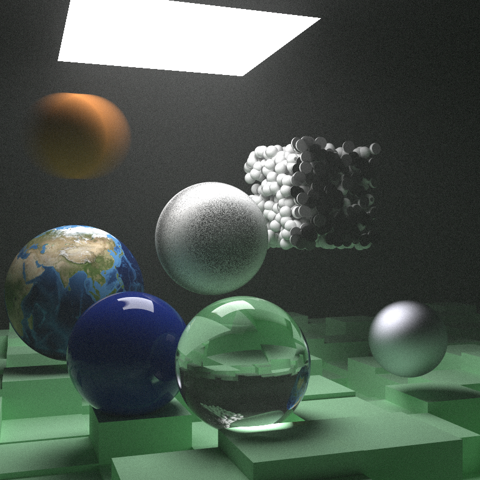

# rtnw

It is a Rust implementation of ["Ray Tracing: The Next Week" by Peter Shirley](https://raytracing.github.io/books/RayTracingTheNextWeek.html)

using an improved version of Bvh which you can find in the [aabb-rewrite branch](https://github.com/RayTracing/raytracing.github.io/tree/aabb-rewrite).

i slight change [zhing2006's code](https://github.com/zhing2006/Ray-Tracing-in-One-Weekend-CN/blob/dev_cn/rust/TheNextWeek/src/rtw_stb_image.rs) to render the earth image

also, i found it useful [cbiffle's implementation](https://github.com/cbiffle/rtiow-rust) when i was trying to optimaze my Bvh code.

